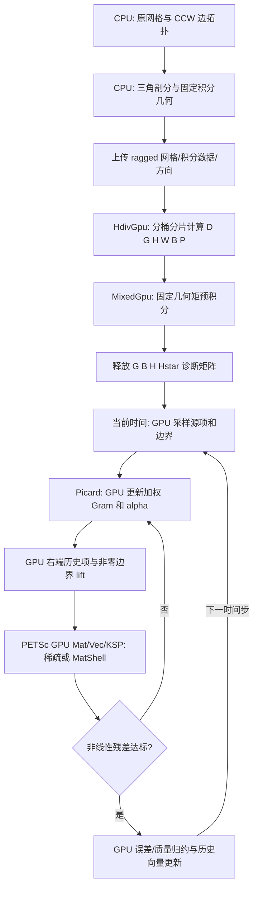

# 混合 H(div)–L² VEM 的 GPU 实现

本工程以 `../CurvedVEM_Darcy` 为数学基准，保留其 CPU 网格读取、边拓扑、三角剖分与曲边映射。H¹ 参考工程仅用于了解 CUDA 数据组织，不移植 H¹ 投影公式。

## 1. 空间、自由度和方向

在计算单元 E 上，标量空间为 P_k，维数 q=(k+1)(k+2)/2。通量空间的可计算多项式部分为 [P_k]²，使用原代码的梯度基 ∇P_{k+1}/R 与散度为零的代数补基。后者并非一般意义下的 L² 正交补。

局部自由度按如下次序排列（所有积分均不除以边长或面积）：

1. d_(r,e)(v)=∫_e(v·n_E)t_E^r ds，r=0,…,k，t_E∈[-1/2,1/2]；索引 r*n_edges+e。
2. ∫_E v·∇m_j，m_j∈P_k/R，共 q−1 个。
3. ∫_E v·g_j^⊥，共 k(k+1)/2 个。

n_v=(k+1)n_edges+q−1+k(k+1)/2。多项式基维数 p=2q；注意内部梯度矩维数 q−1 与多项式梯度空间维数 (k+2)(k+3)/2−1 不同。

公共边的规范方向沿 `edge_endpoints`，局部方向沿单元 CCW。反向时 n_E=−n_global 且 t_E=−t_global，所以 d_local=(-1)^(r+1)d_global。偶数矩变号，奇数矩不变。原 CPU 仅对内部边应用此规则，边界边保留唯一相邻单元的外法向与局部参数；本实现保持该约定。

令 R_E 为全局到局部编号提取，S_E 为上述符号对角阵。全局算子为 Σ R_Eᵀ S_E A_E S_E R_E。读入、回写各乘一次，投影本身不带全局符号。

## 2. 基础计算父类

`HdivGpu` 只处理几何和投影，方程子类不重复计算这些数据。

- D_(i,a)=d_i(g_a)，G_(a,b)=∫_E g_a·g_b。
- H_(r,s)=∫_E m_r m_s；H*_(a,r)=∫_E m_(a+1)m_r。
- W_(r,i)=∫_E m_r div φ_i，由分部积分得边迹系数减内部梯度矩 Kronecker 项。
- div 重构系数为 H⁻¹W。
- 边质量矩阵 H_e=(∫_e t^(r+s))，边交叉矩 H*_e=(∫_e m_(a+1)t^r)。
- B_grad=−H* H⁻¹W + Σ_e H*_e H_e⁻¹ R_e；B_comp 为内部补矩选择矩阵。
- B=[B_grad; B_comp]，P=G⁻¹B，Π_dof=DP。

使用 GPU 上带主元选取的小矩阵消元，求解失败显式报告单元编号。验收恒等式为 BD≈G、PD≈I、(DP)²≈DP，另与 CPU 每个矩阵逐项对比。

## 3. Piola 与方程子类

x=F(ξ)，J=DF，d=det J>0。物理通量 u=(J û)/d，标量 p=p̂∘F⁻¹。

Darcy：T=Jᵀ K⁻¹ J/d；当前原算例 K=I。A_E=PᵀG_TP+α(I−DP)ᵀ(I−DP)，α=||平均 T||_F。混合块为 [A,−Wᵀ; W,0]，法向通量作为本质约束；物理压力零均值由 ℓ_r=∫m_r d 与一个全局乘子实现。

MS：T=JᵀJ/d。Ā_ij(c)=c*δ_ij+A_ij(c)，A_ii=Σ_(j≠i)(c_ij−c*)c_j，A_ij=−(c_ij−c*)c_i。一致项使用 G_(Ā_ij T)。仅对角块有稳定项，系数严格采用原 CPU 的 ||平均(A_ii T)||_F+||平均(c*T)||_F，不能擅自对非对角项添加稳定化。

质量 M_rs=∫m_r m_s d。Euler 块为 [A_ij,−δ_ij Wᵀ; δ_ij W,δ_ij M/Δt]；BDF2 第二步开始 M 系数为 3/(2Δt)，历史项为 M(4c^(n−1)−c^(n−2))/(2Δt)。第一步和第二步历史中的 c⁰直接在积分点评估，保留原实现语义。

## 4. 分片与线程分配

按边数分桶，同一桶 k、n_v、p、q 固定；每桶划分有限数量单元的 launch 分片。每单元默认一个 128 线程 block（4 warps），线程按矩阵元素或向量行分工，积分点循环在寄存器中累加。桶内矩阵按单元连续、行主序存放。GPU 自行把 blocks 调度到 SM，不人为固定某单元占某 CUDA core。

小矩阵消元和算子中间向量放 shared memory；每线程只保留标量累加器，不放整块 n_v² 局部数组。持久显存保留 D、P、G、B、H、W 和方程的小矩阵，MatShell 模式的 matvec 不形成 A_E；默认稀疏路径根据同样因子在 GPU 写出 A_E 的 COO 条目。稳定项应用依次为 z=Pv、r=v−Dz、s=Dᵀr、y=α(r−Pᵀs)，一致项为 Pᵀ(G_Tz)。MS 的组分耦合在投影空间进行。

相邻单元共享边以 double atomicAdd 累加。内部自由度可直接写入，但统一原子路径简化首版；浮点累加次序不确定，测试使用容差。边界算子使用 Q A Q+(I−Q)，右端 Q(b−Ag)+g，支持非零通量；不能仅把受约束行清零而遗漏右端修正。

代数层由 PETSc Mat/Vec/KSP/PC 管理。默认 GPU COO 装配与 GPU ILU(0)，Darcy 用 natural 消元顺序，MS 用 ND 排序；FGMRES 的 Krylov 基、正交化和向量运算由 PETSc 执行；MatShell 模式保留原单元因子作用与对角近似。接受解前独立复算原方程真实残差。参见 [PETSc 重构](PETSc_GPU重构.md)。

## 5. 后处理和验证顺序

GPU 按单元重构 Pû、标量多项式、H⁻¹Wû，积分并归约误差与质量。同时报告计算域范数（用于对照旧 CPU）和物理域范数：标量乘 d；通量先 Piola 正变换再乘 d。原 CPU 的 MS 通量误差实际是计算域范数，不能误标物理范数。

步骤：网格打包→GPU 基础矩阵→CPU 对照与恒等式→方程系数→matrix-free 对照显式装配→边界→求解→时间推进→误差/质量→CUDA 内存检查与计时。每阶段临时 `tests/test_stage.*` 写入、执行、保留结果日志、通过后删除测试文件内容/源文件，再推进下一阶段。最终提供可重复执行的验收入口及实际运行记录。

此文是实施设计；实际完成情况、参数范围、性能与尚有限制以工作日志和验收报告为准，不能把设计数值当作实測加速比。

## 6. 已实现的局部空间与完整流程

计算域局部空间取法向迹 ∈P_k(e)、div v∈P_k(E)、rot v∈P_(k−1)(E) 的混合 VEM 空间；k=0 时旋度空间为零。物理曲边空间通过 Piola 变换得到，边上的矩使用计算域参数；不能用物理弧长单项式替换后继续沿用同一个方向/投影公式。

Darcy 的方程为 u=−K∇p、div u=g。MS 为 ∂_t c_i+div J_i=f_i、∇c_i+Σ_j Ā_ij(c)J_j=0。本实现保持原 CPU 的法向通量本质边界与试函数零法向迹；Darcy 的额外乘子施加物理压力零均值。

## 7. MS 系数更新的精确预积分收缩

由于原 A_ij 对 c 线性，设 c_i=Σ_r c_(i,r)m_r，定义 a_(ij,r)=Σ_(l≠i)bar_c_(il)c_(l,r)（i=j），或 −bar_c_(ij)c_(i,r)（i≠j）。在固定几何上预积分

C_(r,a,b)=∫m_r g_aᵀTg_b，Z_(r,μν)=∫m_r T_(μν)。

则加权 Gram 恰为

G_ij=c*δ_ij C_0+Σ_r a_(ij,r) C_r，

而稳定系数由 Σ_r a_(ii,r)Z_r 与 c*Z_0 的平均 Frobenius 范数分别计算再相加。其积分规则与直接 GPU 积分相同，**没有额外近似，也不是对浓度取单元均值**。初值模式仍直接在积分点取原初值，正确处理间断初值和被间断面穿过的单元。

缓存额度足够时，多项式 Picard 更新不再访问积分点；超出 256 MiB 缓存预算则采用原直接积分核。阶次 k=0..4、正弦/半圆环/Q8 映射均与直接路径对照。

## 8. 阶次、预条件与范数说明

- 最终支持 k=0..4。k=3 默认 12 点，亦允许 36 点；k=4 使用 6×6 Duffy 规则以覆盖高阶交叉矩。该扩展只修改新工程几何打包层，原网格代码不动。
- 早期自写 CGS2 GMRES 已由 PETSc KSP 取代；当前用 PETSc 的经典 Gram–Schmidt 和始终再正交化，每次接受线性解前复算真实残差。
- 预条件通量分母为组装的局部 A_ii 对角；压力近似为 |rate M_rr|+Σ_j W_rj²/d_j，乘子用相应约束对角近似。它是便宜的对角近似，不是精确 Schur 补，也没有宣称网格无关迭代数。
- 散度误差使用 H⁻¹WÛ 的重构，再除以 detJ 得物理散度。MS 制造解比较 f−∂_t c；压力和通量的物理 L² 采用正向 Piola 及物理测度。无真解例仅以守恒和残差验收。
- 浮点原子累加次序不固定；禁止用 bitwise equality 作为全局装配标准。四阶缩放单项式条件数较高，因此与低阶采用不同再现性容差。

## 主函数配置与实际执行流程（2026-09-10 更新）

1. `src/main.cpp` 中明确指定方程/算例、网格、阶次、时间参数、容差、GPU 分片与输出文件名；`src/main_all.cpp` 明确列出要计算的各个算例。
2. `validated_options()` 统一校验并解析自动积分点数；`run_case()` 保存 `parameters.txt`，从原 CPU 读取器准备网格。
3. `HdivGpu` 构造几何与基础矩阵，`MixedGpu` 生成方程因子；Darcy 求解一次，MS 在驱动内执行 Euler/BDF2 + Picard + PETSc FGMRES。
4. GPU 完成误差与质量归约，按 main 指定名称输出；批量 `run_examples()` 记录各例真实报告路径。

本轮只调整配置入口、结果命名及代码注释/格式，以上数学公式和 CUDA 核的计算表达式保持不变。

## 独立主函数中的时间与空间尺度

当前正式入口在 `main/Darcy_*_main.cpp`、`main/MS_*_main.cpp`，每个主函数只处理一个算例的网格序列。`src/mesh_study.cpp` 读取真实单元面积/直径，默认 h=sqrt(area/N)，非均匀网格可选 h_max。

时间阶 p=2（BDF2）或 1（Euler），按 dt_target=C h^((k+1)/p) 匹配时间与空间误差阶。取 N≥ceil(T/dt_target)，BDF2 至少两步，可向上选 2^a*5^b，实际 dt=T/N；所有网格比较时刻相同。该阶数匹配不代表粗网格已达到渐近阶，终端保留实际计算出的零/负阶。

选定同一范数，空间阶为 log(e_old/e_new)/log(h_old/h_new)。默认计算域范数与原 MS 接口一致，也可明确切换物理域。MS 1/3 无解析解，不生成解析误差阶；只比较初末物理质量等可验证指标。

结果由求解器直接返回 `CaseResult`，每层完成立即输出并刷新累计 CSV/文本表；时间使用 steady_clock 墙钟及 GPU 同步，区别总耗时与准备/迭代/诊断/解保存子阶段。
